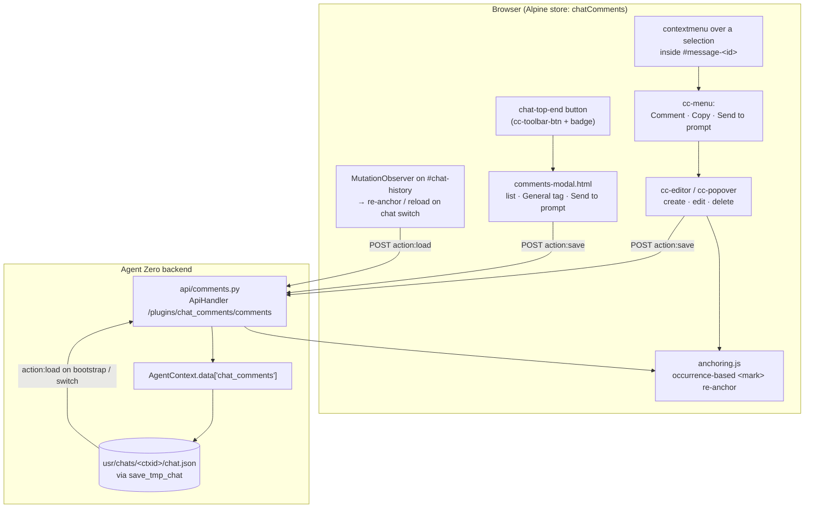

# Chat Comments — Agent Zero plugin

<!-- BADGES:START (generated by the devkit — `make badges`) -->

[](https://github.com/agent-zero-plugins/agent-zero-plugin-chat-comments/actions/workflows/plugin-e2e.yml) [](https://github.com/agent-zero-plugins/agent-zero-plugin-chat-comments/tree/main/tests/e2e/features) [](https://github.com/agent-zero-plugins/agent-zero-plugin-chat-comments/tags) [](https://github.com/agent-zero-plugins/agent-zero-plugin-chat-comments/blob/main/LICENSE) [](https://github.com/agent-zero-plugins/agent-zero-plugin-chat-comments/blob/main/CONTRIBUTING.md)

<!-- BADGES:END -->

> Select text in any chat message and attach a **Google-Docs-style comment** to it.
> Comments are highlighted inline, listed in a manager modal, **persisted per chat**,
> and can be sent to the prompt box as a single review request for the agent to address.

`chat_comments` turns an Agent Zero conversation into something you can *mark up*. Reviewing a long
agent answer? Highlight the sentence that's wrong, comment on it, and — when you're done — send every
comment to the prompt in one go so the agent addresses them together.

---

## Why you'd want it

| Without | With Chat Comments |
|---|---|
| Scroll back, retype "the third paragraph is wrong because…" | Select the text → **Comment** → it's anchored right there |
| Lose your review notes when you switch chats | Comments **persist on the chat**, survive reloads and chat switches |
| Feed corrections one message at a time | **Send to prompt** bundles every comment into one numbered request |
| No record of what you flagged | A comments modal lists every note, anchored or general |

---

## Features

- **Anchor a comment to selected text** — right-click a selection inside a message → *Comment*; the
  phrase is wrapped in a highlight (`<mark>`) that survives re-renders via occurrence-based re-anchoring.
- **General (untethered) comments** — add a chat-level note from the modal that isn't tied to any span.
- **View / edit / delete** — click a highlight for a popover with the note plus Edit and Delete.
- **Persistence** — comments are stored on the chat itself and reload with it; switch away and back and
  they're still there.
- **Send to prompt** — turns all comments into one numbered instruction (anchored items quote their
  referenced text) and drops it into the composer.
- **Copy / send a selection** — the selection menu also offers *Copy text* and *Send to prompt* (append).
- **Badge** — the toolbar button shows a live count.

---

## Architecture



**Persistence flow:** every create/edit/delete calls `persist()` → `POST {action:"save"}` →
`api/comments.py` sanitises the list and writes `AgentContext.data["chat_comments"]`, then
`save_tmp_chat` flushes it to `usr/chats/<ctxid>/chat.json`. On bootstrap and on chat switch the store
`POST {action:"load"}`s that same key back and re-anchors the highlights. **No data ever leaves the
machine running Agent Zero.**

---

## Install

### Plugin Hub (recommended)

Open **Settings → Plugins**, find **Chat Comments**, and install. Enable it; the comment button appears
in the chat top bar.

### Manual

Copy the plugin into your Agent Zero instance:

```bash
cp -r usr/plugins/chat_comments /path/to/agent-zero/usr/plugins/chat_comments
```

Restart / reload plugins. No configuration required.

---

## Configuration

The plugin is zero-config. For reference:

| Manifest field | Value | Meaning |
|---|---|---|
| `name` | `chat_comments` | plugin id (matches the Plugin Index folder) |
| `settings_sections` | `[]` | no settings screen — nothing to configure |
| `per_project_config` | `false` | comments are per-chat, not per-project |
| `per_agent_config` | `false` | not agent-scoped |
| `license` | `Apache-2.0` | see [LICENSE](LICENSE) |

Internal constant: `MAX_COMMENT_LENGTH = 2000` (both client and server clip to this).

---

## Comment record schema

Each comment persisted on a chat:

| Field | Type | Notes |
|---|---|---|
| `id` | str | client-generated uuid |
| `message_id` | str | id of the message the highlight anchors to (`""` for General) |
| `quoted_text` | str | the selected text (`""` for General) |
| `occurrence` | int | which match of `quoted_text` in the message (0-based) |
| `comment` | str | the note (≤2000 chars) |
| `created_at` | int | unix seconds |

---

## Development & testing

```bash
git clone --recursive https://github.com/agent-zero-plugins/agent-zero-plugin-chat-comments
cd agent-zero-plugin-chat-comments

# L1 shape suite (fast, testkit assertions)
pip install pytest pyyaml
pytest                       # 11 tests: extension surface, hooks, thumbnail, deps, A0-API, auth posture

# Tier-1 BDD static gates (feature-purity, honesty, traceability)
make verify

# Full L3 behaviour BDD against a disposable A0 (needs podman/docker)
make e2e
```

The behaviour contract lives in [`docs/spec/`](docs/spec/) (`behaviour-spec.md` BEH-1..14) and the
executable BDD in [`tests/e2e/features/10-comments.feature`](tests/e2e/features/10-comments.feature).
CI (`plugin-e2e`) runs the full suite on every PR, including a **seam-off red-proof** (the suite must
fail with the plugin uninstalled) — so green means the behaviour is genuinely exercised live.

---

## Security

Comments live only in your chat data (`AgentContext.data["chat_comments"]` → `usr/chats/<id>/chat.json`)
on the machine running Agent Zero. The plugin makes **no external network calls** and adds **no**
telemetry. See [SECURITY.md](SECURITY.md).

---

## License

[Apache-2.0](LICENSE).