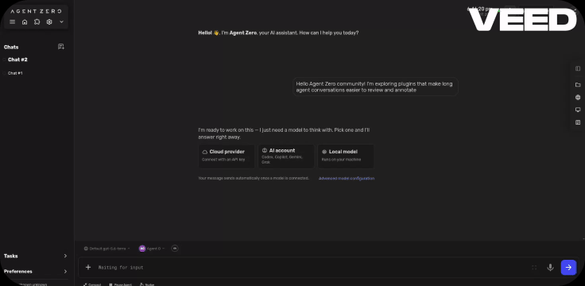
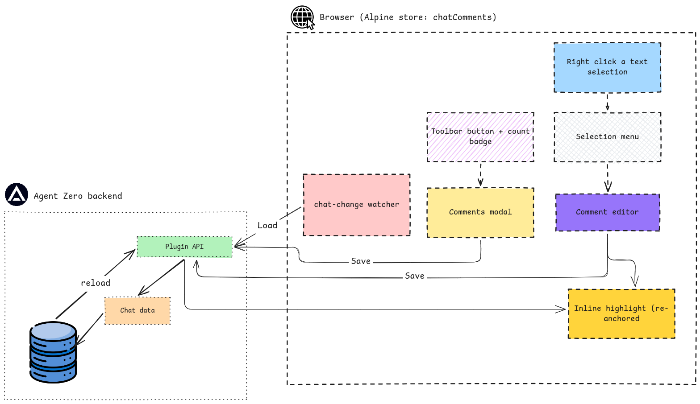

# Chat Comments — Agent Zero plugin

<!-- BADGES:START (generated by the devkit — `make badges`) -->

[](https://github.com/agent-zero-plugins/agent-zero-plugin-chat-comments/actions/workflows/plugin-e2e.yml) [](https://github.com/agent-zero-plugins/agent-zero-plugin-chat-comments/tree/main/tests/e2e/features) [](https://github.com/agent-zero-plugins/agent-zero-plugin-chat-comments/tags) [](https://github.com/agent-zero-plugins/agent-zero-plugin-chat-comments/blob/main/LICENSE) [](https://github.com/agent-zero-plugins/agent-zero-plugin-chat-comments/blob/main/CONTRIBUTING.md)

<!-- BADGES:END -->

> Select text in any chat message and attach a **Google-Docs-style comment** to it. Comments are highlighted inline, persisted per chat, and sendable to the prompt as one numbered review request.



Chat_comments turns an Agent Zero conversation into something you can mark up. Reviewing a long agent answer? Highlight the sentence that's wrong, comment on it, and, when you're done, send every comment to the prompt in one go so the agent addresses them together.

## ✨ Features

- **Anchored comments** : select a phrase in any message (yours or the agent's) → right-click → **Comment**. The phrase gets an inline highlight that survives re-renders via occurrence-based re-anchoring.
- **General comments** : chat-level notes that aren't tied to any span, for "this whole exchange went wrong" moments.
- **Manage from one place** : click a highlight for its popover (**Edit** / **Delete**), or open the toolbar modal to see every note; the toolbar button carries a live count badge.
- **Send to prompt** : collapses all comments into a single numbered instruction — anchored items quote their text — and drops it into the composer. Review the transcript, then hand the whole critique back in one turn.
- **Persistence** : comments are stored on the chat itself (`usr/chats/<id>/chat.json`), so they survive reloads and chat switches.
- **Honest refusals** : empty comments are rejected, and the backing service refuses malformed requests — both are asserted BDD scenarios.

## ⚙️ How it works




A `chat-top-end` webui extension plus one API handler. Every create/edit/delete saves through the plugin's own endpoint; bootstrap and chat switches load the same key back and re-anchor. No external network calls, no telemetry.

## 💬 Usage

Nothing to configure — the comment button appears in the chat top bar. Every behaviour below has an asserted [BDD scenario](tests/e2e/features/), and [`docs/BEHAVIOUR.md`](docs/BEHAVIOUR.md) shows each as a screenshot from a passing run.

**Anchored comments** — select text, right-click, **Comment**. One message can carry several; the comment records which text it refers to, so the note still makes sense later. Click a highlight to reopen, edit, or delete it.

**General comments & send-to-prompt** — open the toolbar modal to add a chat-level note, or hit **Send to prompt** to bundle every comment into one numbered request for the agent. The selection menu also offers _Copy text_ and a direct _Send to prompt_.

## 📦 Installation

**Plugin Hub** — once listed in the [Plugin Index](https://github.com/agent0ai/a0-plugins): **Settings → Plugins → Chat Comments → Install**.

**Manual** (Zip) — build it yourself, or grab the zip from the [latest release](https://github.com/agent-zero-plugins/agent-zero-plugin-chat-comments/releases/latest):

```bash
make package        # → dist/chat_comments.zip
```

Then **Settings → Plugins → Install from file** → pick the zip. Or copy the plugin into your instance (`usr/plugins/chat_comments/`) and reload plugins.

## 🔧 Configuration

None — zero-config, no settings screen. One internal constant: `MAX_COMMENT_LENGTH = 2000` (both client and server clip to it).

## 🛠️ Development

```bash
git clone --recurse-submodules https://github.com/agent-zero-plugins/agent-zero-plugin-chat-comments
cd agent-zero-plugin-chat-comments

make verify                  # BDD static gates
python -m pytest tests -q    # unit + L1 shape suite (needs tests/_testkit submodule)
make e2e                     # full behaviour BDD run on a nested disposable A0 (podman)
```

Each comment persisted on a chat:

| Field         | Type | Notes                                                 |
| ------------- | ---- | ----------------------------------------------------- |
| `id`          | str  | client-generated uuid                                 |
| `message_id`  | str  | message the highlight anchors to (`""` for General)   |
| `quoted_text` | str  | the selected text (`""` for General)                  |
| `occurrence`  | int  | which match of `quoted_text` in the message (0-based) |
| `comment`     | str  | the note (≤2000 chars)                                |
| `created_at`  | int  | unix seconds                                          |

## 🧪 Test layout

| Layer         | Where                            | What                                                                    |
| ------------- | -------------------------------- | ----------------------------------------------------------------------- |
| L1 shape      | `tests/test_plugin_shape.py`     | static validator, deps/A0-API audits, dead hooks                        |
| Static gates  | `make verify`                    | feature-purity, honesty, traceability                                   |
| Behaviour BDD | `tests/e2e/features/` + `steps/` | anchored/general comments, edit/delete, persistence, refusals, e2e APIs |

Specs live in [`docs/spec/`](docs/spec/) (BEH-1..14). CI runs the whole pyramid on every PR, including a seam-off red-proof — a scenario that passes without the plugin fails the build.

## ⚖️ License

Apache-2.0 — see [LICENSE](LICENSE). Comments never leave the machine running Agent Zero; see [SECURITY.md](SECURITY.md).
