# Chat Comments — behaviour

<!-- GENERATED by the devkit (`make docs`) from this plugin's own e2e run.
     Do not edit by hand: every screenshot below is the asserted end state of a
     passing BDD scenario, so it cannot show behaviour the plugin no longer has.
     Captions are the scenario titles verbatim — reword them in tests/e2e/features/. -->

Each section is one scenario from `tests/e2e/features/`, with the screenshot the
test captured at its final assertion. 11 of 12 scenarios have one.

## Commenting on a chat

### The comments control is present
BEH-1, UI-1

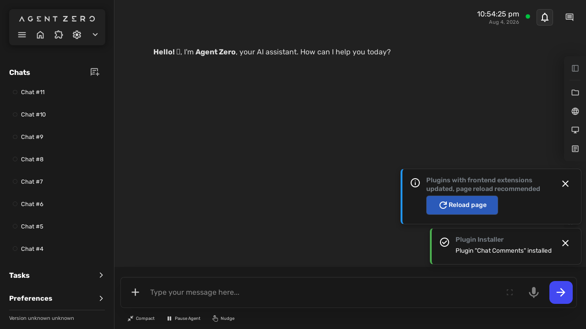

### A comment added to a chat is remembered
BEH-2, BEH-11, BEH-12

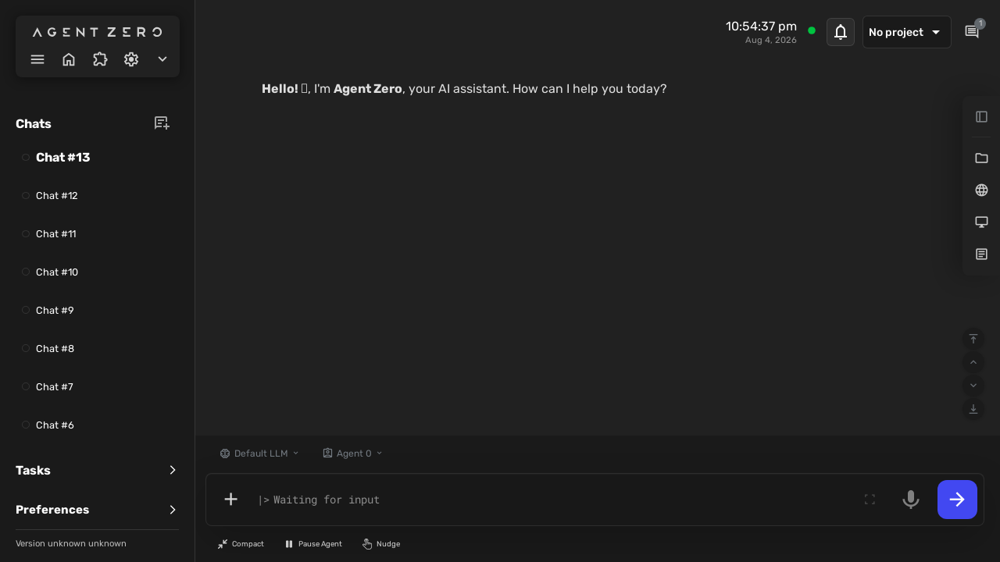

### A comment can be attached to selected message text
BEH-5, BEH-7, BEH-8

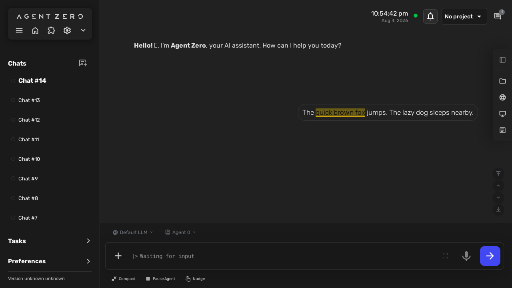

### A comment carries its attribution and creation time
BEH-8, BEH-11

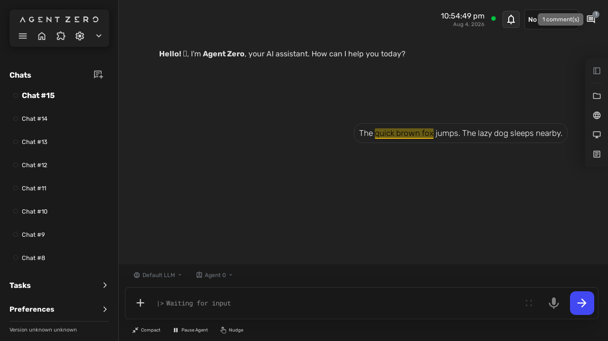

### A comment can be edited
BEH-10

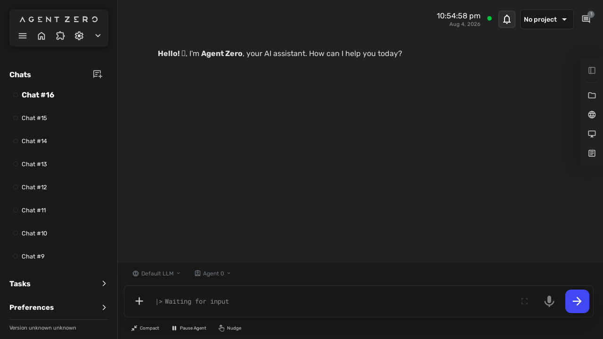

### A comment can be deleted
BEH-10

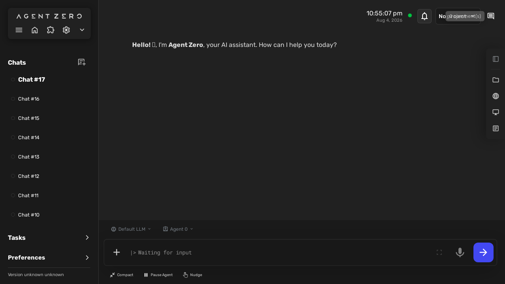

### Comments stay with their chat when I switch away and back
BEH-3

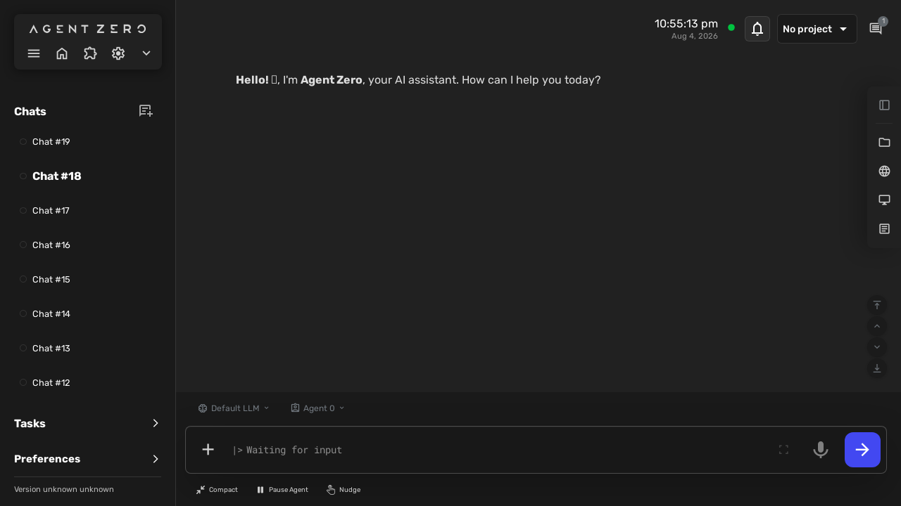

### One message can carry several comments
BEH-8, BEH-9

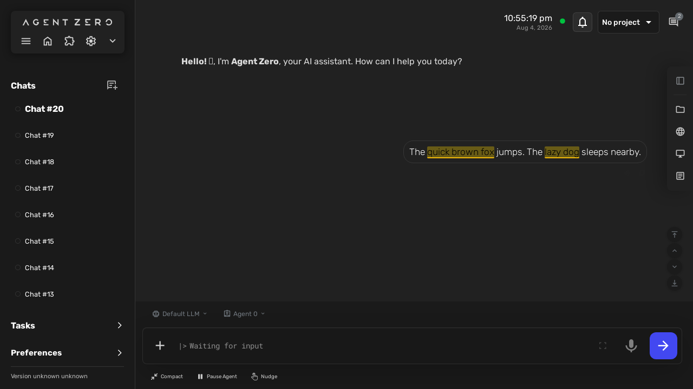

### Both my messages and agent replies can be commented
BEH-5, BEH-8

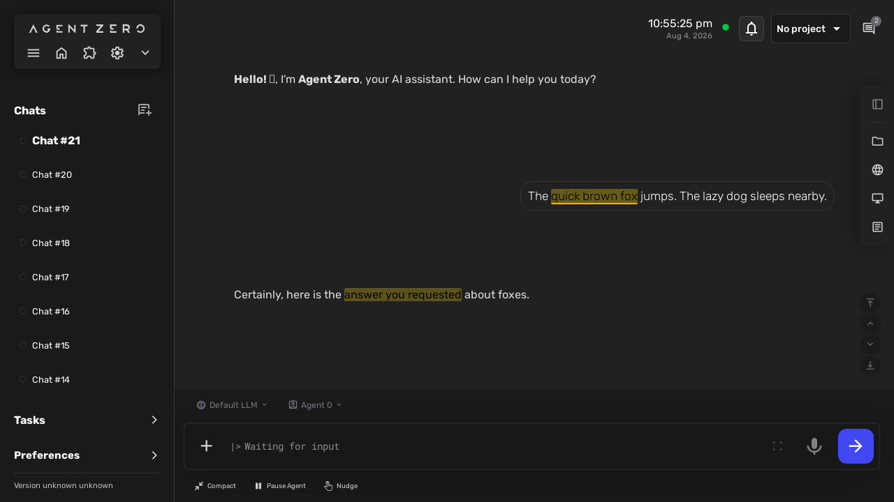

### An empty comment is not accepted
BEH-8, BEH-12, EC-6

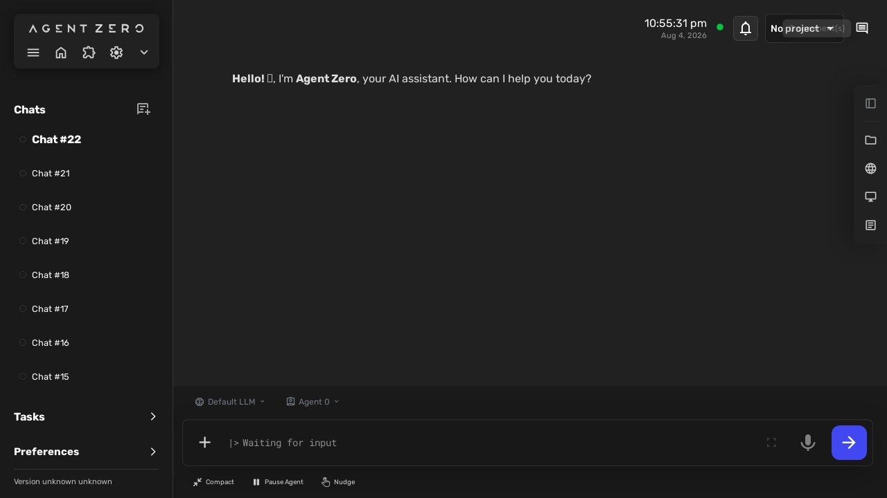

### The comments service rejects malformed requests
BEH-11, EC-4

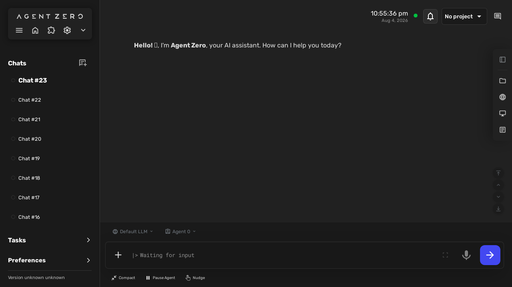

### Comments can be sent to the prompt box
BEH-13, BEH-14

_No screenshot captured for this scenario in the last run._
